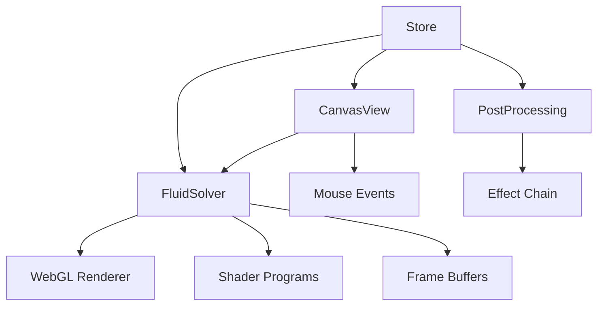

# Technical Documentation

## System Architecture



## Core Components

### 1. FluidSolver (`src/utils/FluidSolver.ts`)
The heart of the simulation, implementing Navier-Stokes equations using WebGL.

#### Shader Uniforms
```typescript
// Common uniforms across shaders
interface CommonUniforms {
  texelSize: { value: THREE.Vector2 };    // 1/width, 1/height
  dt: { value: number };                  // Time step
  time: { value: number };                // Current time
}

// Advection shader uniforms
interface AdvectionUniforms extends CommonUniforms {
  velocity: { value: THREE.Texture };     // Velocity field
  source: { value: THREE.Texture };       // Source field
  dissipation: { value: number };         // Dissipation rate
}

// Pressure solver uniforms
interface PressureUniforms extends CommonUniforms {
  pressure: { value: THREE.Texture };     // Pressure field
  divergence: { value: THREE.Texture };   // Divergence field
}

// Visual effect uniforms
interface EffectUniforms {
  bloomStrength: { value: number };       // Bloom intensity
  chromaticAberration: { value: number }; // Color separation
  motionBlurStrength: { value: number };  // Motion blur
  kaleidoscopeSegments: { value: number };// Kaleidoscope
}
```

#### Key Methods
```typescript
class FluidSolver {
  // Core simulation steps
  step(dt: number): void
  advectVelocity(): void
  computePressure(): void
  applyVorticity(): void
  
  // Interaction
  splat(x: number, y: number, dx: number, dy: number, color: [number,number,number]): void
  
  // Resource management
  dispose(): void
}
```

[... rest of the file remains unchanged ...] 